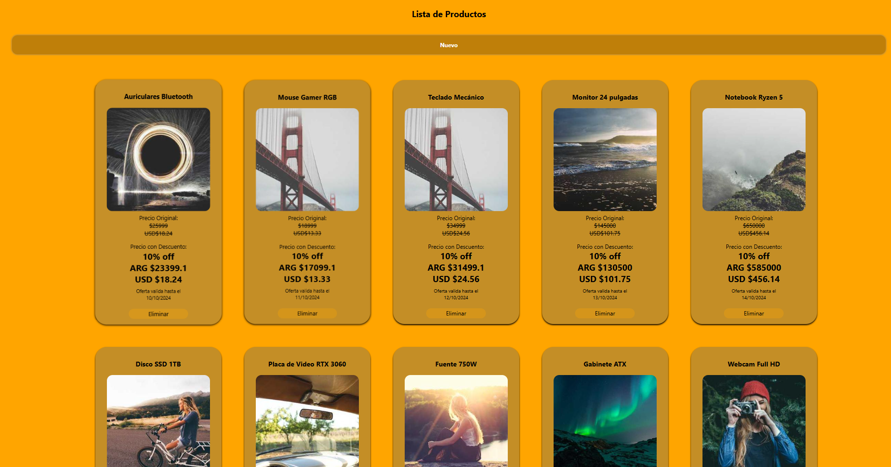
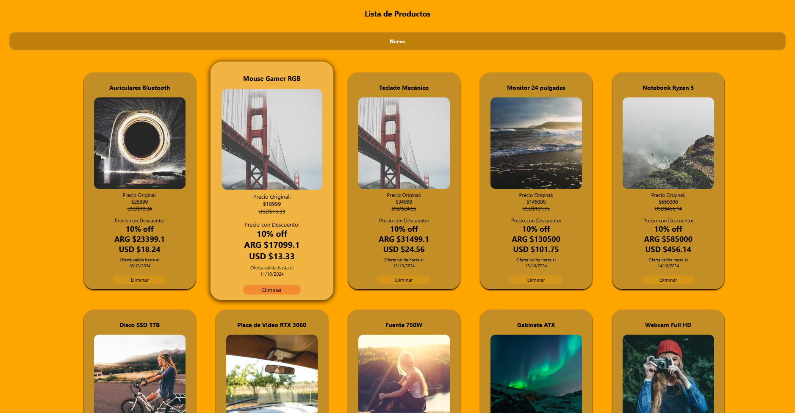

# ANGULAR INTERMEDIO - MODULO 1 UNIDAD 3

Este proyecto corresponde a la **unidad 3 del Modulo 1** de la diplomatura Full Stack.
Aqui se creo en Angular una pagina donde se utilizo **servicios** y **pipes** para la visualizacion de datos locales.

---

## Como ver el proyecto

1. Clonar repositorio

```
 git clone https://github.com/JDamianDelgado/Tarea-2-Angular.git
```

2. Instalar dependencias

```
npm install
```

3. Ejecutar el Proyecto

```
npm run start
```

El proyecto debe correr en 'http://localhost:4200/' por defecto

## Autor

Nombre: Joaquín Damián Delgado

Curso: Diplomatura Full Stack

Unidad: Módulo 1 – Unidad 3

Fecha: Diciembre 2025

## Capturas

### Pantalla Principal



### Creacion de producto


### Vista de productos


